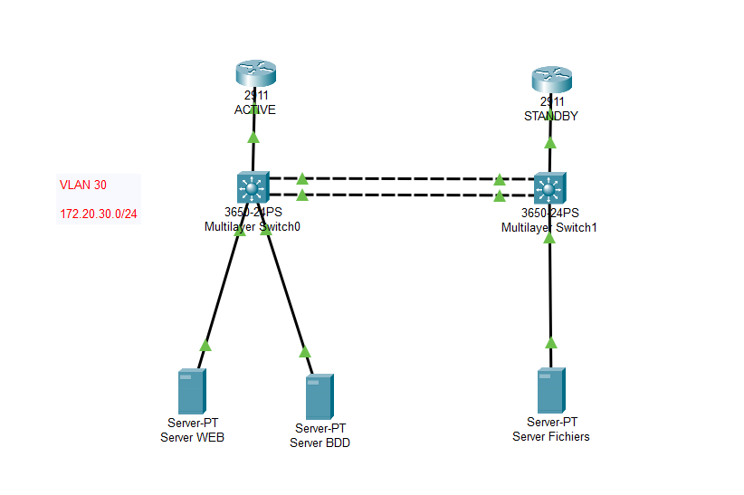
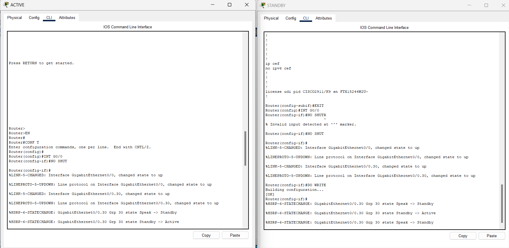
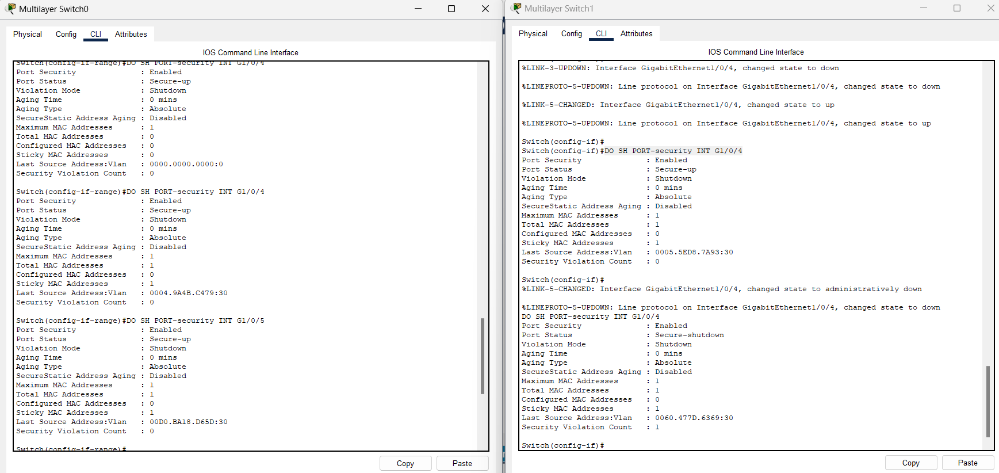
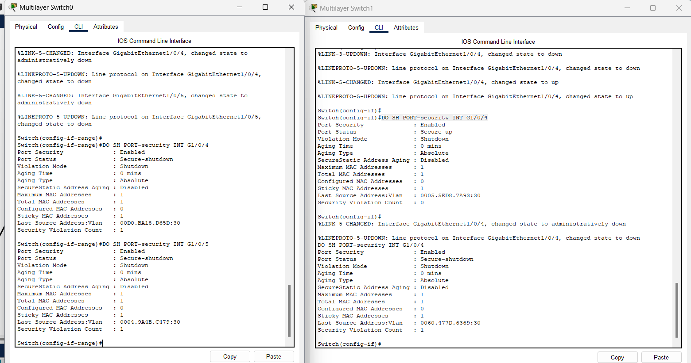
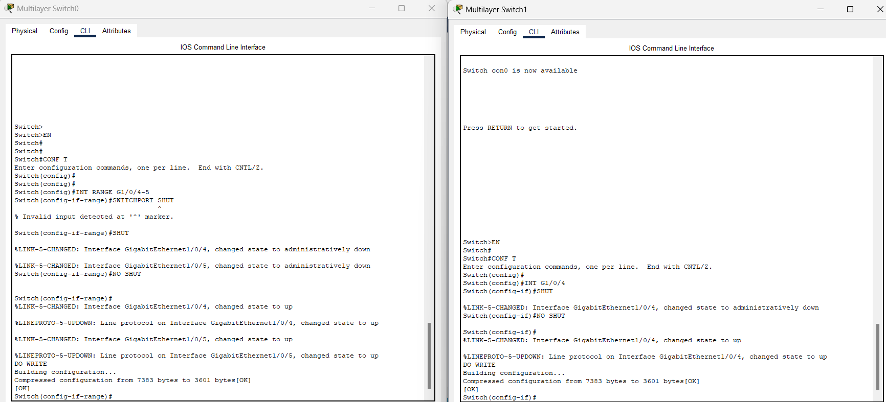
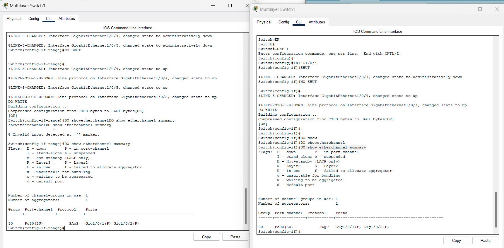
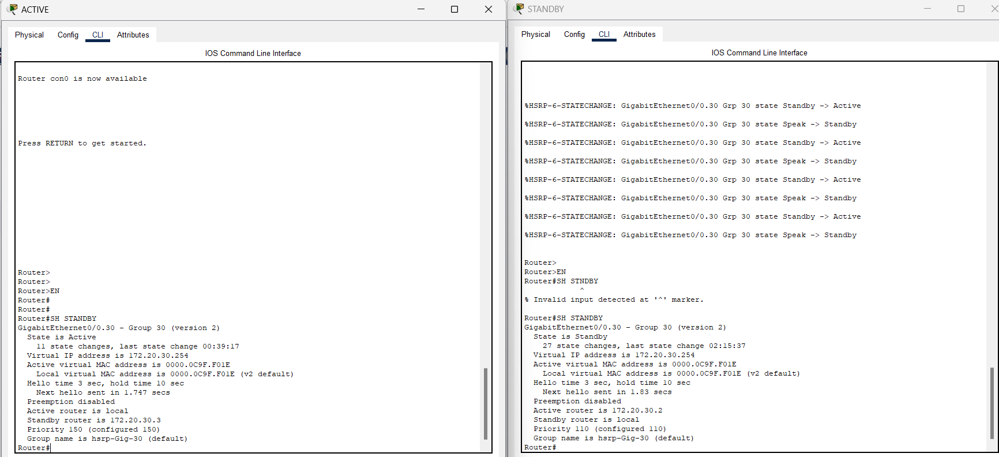
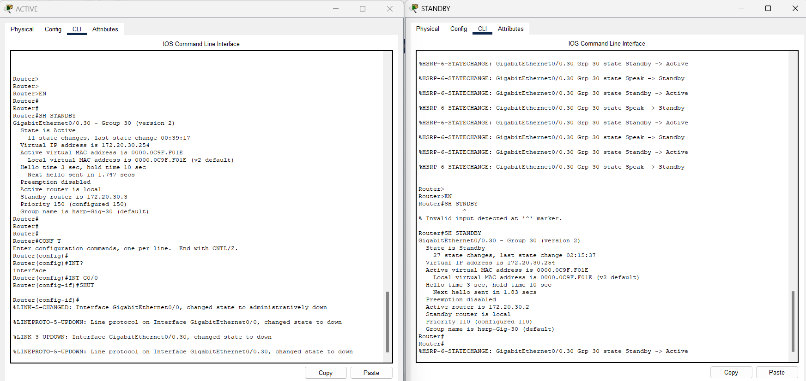

# 🏭 Datacenter Redondant — EtherChannel, HSRP & Sécurité de Ports


> Conception d'une architecture de salle serveur sans point de panne unique : agrégation de liens entre switches de distribution, passerelle redondante entre deux routeurs de sortie, et verrouillage strict des accès physiques aux ports serveurs.

---

## 🎯 En bref

Ce projet reproduit l'architecture réseau d'une salle serveur d'entreprise nécessitant une **disponibilité maximale** au niveau des switches et des routeurs de sortie, avec un **contrôle strict des accès physiques**. Il combine agrégation de liens (EtherChannel), redondance de passerelle et sécurisation des ports serveurs pour garantir la continuité de service même en cas de panne matérielle ou de tentative d'intrusion physique.

**Compétences mises en œuvre :**
- Agrégation de liens **EtherChannel en PAgP** (mode *desirable*) entre deux switches de distribution
- Redondance de passerelle via un protocole de type **FHRP** (bascule Active/Standby observée et validée)
- **Port Security** avec verrouillage MAC sticky et politique de violation en *shutdown*
- Ajustement de la **priorité Spanning Tree** pour orienter le chemin préférentiel du trafic
- Diagnostic et validation via les commandes IOS (`show etherchannel summary`, `show standby`, `show port-security interface`)
- Procédure de test réel d'une violation de sécurité et de réactivation d'un port verrouillé

---

## 🗺️ Architecture



L'infrastructure repose sur :
- **2 routeurs de sortie** (ACTIVE / STANDBY) partageant une adresse IP virtuelle sur le VLAN 30 (serveurs),
- **2 switches de distribution multicouches** (3650-24PS) reliés par un **Port-Channel PAgP** agrégeant deux liens physiques,
- **3 serveurs** (Web, BDD, Fichiers) répartis sur les deux switches, chacun protégé par Port Security.

## 🔢 Plan d'adressage

| Segment / rôle       | Réseau            | Remarques |
|------------------------|-------------------|-----------|
| VLAN 30 — Serveurs      | 172.20.30.0/24    | R1 : .2 (Active) · R2 : .3 (Standby) · VIP : .1 |

---

## ⚙️ Réalisations techniques

### Mise en service initiale et redondance de passerelle

Activation des interfaces routées et montée en charge du protocole de redondance : le routeur ACTIVE prend l'état *Active* sur le groupe 30 dès la mise en service, tandis que le routeur STANDBY reste en secours.



### Sécurisation des ports serveurs (Port Security)

Chaque port connecté à un serveur est configuré avec un maximum d'une adresse MAC autorisée (apprentissage `sticky`) et une violation déclenchant automatiquement un `shutdown` du port.



### Test réel d'une violation de sécurité

En branchant un second équipement sur un port serveur déjà verrouillé, la violation est détectée : le compteur `Security Violation Count` passe à 1 et le port bascule en état `Secure-shutdown`, coupant l'accès réseau du port fautif.



### Réactivation contrôlée des interfaces

Après analyse de l'incident, les ports concernés sont réactivés manuellement (`shutdown` / `no shutdown`), restaurant le service tout en conservant l'historique de la violation à des fins d'audit.



### Agrégation de liens EtherChannel (PAgP)

Les deux liens physiques entre les switches de distribution sont regroupés en un **Port-Channel PAgP** (Po30), formant un lien logique unique à la fois plus large en bande passante et tolérant à la panne d'un des deux câbles.



### Vérification de l'état de la redondance de passerelle

`show standby` confirme la répartition des rôles : le routeur ACTIVE détient l'IP virtuelle `172.20.30.254` avec la priorité la plus haute (150), le routeur STANDBY reste prêt à prendre le relais (priorité 110).



---

## ✅ Validation — Test de basculement

Le scénario de panne a été simulé en coupant l'interface active du routeur principal. Les journaux `%HSRP-6-STATECHANGE` confirment la bascule automatique et immédiate du rôle actif vers le routeur de secours, garantissant une continuité de service pour les serveurs du VLAN 30.



---

## 📥 Tester le projet

Le fichier de simulation Cisco Packet Tracer (`.pkt`) est disponible dans ce dépôt : **[Datacenter_redondant.pkt](./Datacenter_redondant.pkt)**.

Ouvre-le avec [Cisco Packet Tracer](https://www.netacad.com/courses/packet-tracer) (gratuit, inscription NetAcad requise) pour :
- explorer la configuration complète des deux switches de distribution et des deux routeurs,
- vérifier l'état de l'agrégation de liens (`show etherchannel summary`) et de la redondance de passerelle (`show standby`),
- simuler toi-même une panne du routeur actif ou une violation de Port Security et observer la réaction du réseau en temps réel.

---

## 🚀 Pistes d'évolution

- **Migrer vers VRRP** (norme ouverte multi-constructeur) tel que prévu initialement dans le cahier des charges, en remplacement du protocole propriétaire Cisco actuellement implémenté (HSRP), pour une architecture interopérable en environnement hétérogène.
- Documenter explicitement l'ajustement de la **priorité de pont STP** pour garantir que le switch de distribution 1 soit désigné racine sur le VLAN 30 (`spanning-tree vlan 30 priority`), et fournir la sortie `show spanning-tree vlan 30` associée.
- Ajouter une capture de `show vlan brief` confirmant l'assignation du VLAN 30 aux ports serveurs sur les deux switches.
- Compléter avec des tests de charge sur le Port-Channel pour valider l'équilibrage réel du trafic entre les deux liens agrégés.

---

## 📂 Structure du dépôt

```
├── README.md
├── Datacenter_redondant.pkt              ← fichier de simulation à ouvrir dans Packet Tracer
├── 00_topologie_schema-reseau.png
├── 01_hsrp_configuration-initiale.png
├── 02_port-security_activation-verification.png
├── 03_port-security_violation-shutdown.png
├── 04_port-security_reactivation-interfaces.png
├── 05_etherchannel_verification-po30.png
├── 06_hsrp_verification-etat-standby.png
└── 07_hsrp_test-basculement-failover.png
```

---

## 👤 Auteur

**ALAYE Odilon Alabi**

N'hésite pas à me contacter pour toute question sur ce projet ou pour échanger sur des opportunités en administration réseau / infrastructure.
